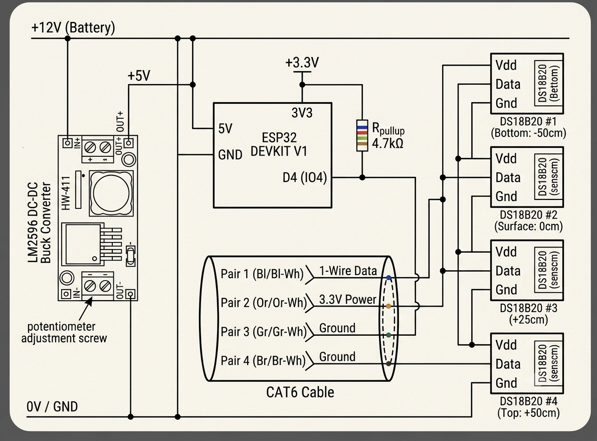

# Project-Glacier-Data-Logger
# Glacier Thermal Gradient & Boundary Layer Logger

An open-source, low-cost, multi-node temperature data logging system designed to capture high-resolution ground-to-air micro-climate thermal gradients on high-altitude glaciers in the Karakoram range (e.g., Biafo Glacier). 

This project aims to provide accessible, in-situ ground-truth data for climate scientists, glaciologists, and disaster risk developers working on Glacial Lake Outburst Flood (GLOF) early warning systems and ablation modeling.

---

## Project Overview

As glacier ablation, melt water runoff, and other surface processes are primarily influenced by air temperatures near the surface, knowledge of the atmospheric boundary layer flow and thermal vertical stratification at the ice-air interface becomes significant. Traditionally, remote, high altitude, climate sensors at a larger scale have represented an expensive approach to glacier observations

### Key Goals:
* **In-Situ Calibration:** Support to satellite remote sensing models. Present vertical ground truths information related to thermal data.
* **Open Hardware:** Reduce the cost hurdle for collection of local field data within remote mountain areas.
* **GLOF Early Warning Support:** Furnish microclimate logs at high resolution for your locally adapted risk-assessment algorithms.
---

## System Architecture

The logging node features an **ESP32 microcontroller** responsible for driving a vertical stack of **DS18B20 digital temperature sensors** daisy-chained over a single heavy-duty Cat6 cable trunk with the 1-Wire protocol.

```text
                  +12V Battery
                       │
             ┌─────────┴─────────┐
             │ LM2596 Buck Conv. │
             └─────────┬─────────┘
                       │ +5V / +3.3V
  ┌────────────────────┴────────────────────┐
  │              ESP32 DEVKIT V1            │
  │                  GPIO4 (IO4)            │
  └────────────────────┬────────────────────┘
                       │ 1-Wire Data Line (+4.7kΩ Pull-Up)
      ┌────────────────┴──────────────────┐
      │          CAT6 Cable Trunk         │
      └───┬────────────┬─────────────┬────┘
          │            │             │
      ┌───┴───┐    ┌───┴───┐     ┌───┴───┐
      │Sens #1│    │Sens #2│     │Sens #3│ ... Vertical Sensor Array
      └───────┘    └───────┘     └───────┘
```





## Hardware Components

| Component | Specification / Details | Function |
| :--- | :--- | :--- |
| **Microcontroller** | ESP32 DEVKIT V1 | System controller, RTC timekeeping & data logging |
| **Temperature Sensors**| Waterproof DS18B20 (1-Wire) | Vertical thermal gradient measurements |
| **Cable Trunk** | CAT6 UTP / STP | Shielded 1-Wire data, power, and ground bus |
| **Power Regulation** | LM2596 DC-DC Buck Converter | Stepping 12V supply down to 5V rail |
| **Power Source** | 12V SLA / LiFePO4 Battery | Field power for long-term deployment |
| **Pull-Up Resistor** | 4.7 kΩ | Required signal line pull-up for 1-Wire bus |

---

## Repository Structure

```text
├── documentation/   <-- Field deployment guides, BOM, and write-ups
├── hardware/        <-- Circuit schematics, wiring diagrams, and pinouts
├── media/          <-- Photos, schematic diagrams, and field test images
├── results/        <-- Analysis, charts, and thermal gradient profiles
├── sample-data/    <-- Raw & formatted CSV test logs from sensor arrays
├── src/            <-- ESP32 firmware source code (.ino / .cpp)
├── .gitignore      <-- Build and environment exclusions
├── LICENSE         <-- MIT Open-Source License
├── README.md       <-- Project homepage
├── contributors.md <-- Project contributors and advisors
└── methodology.md  <-- Field sampling strategy and calibration notes
```
